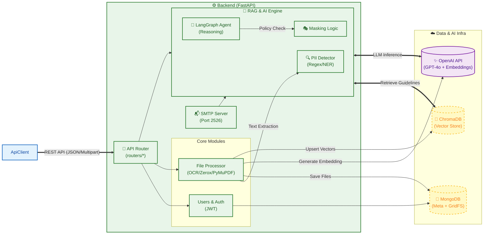
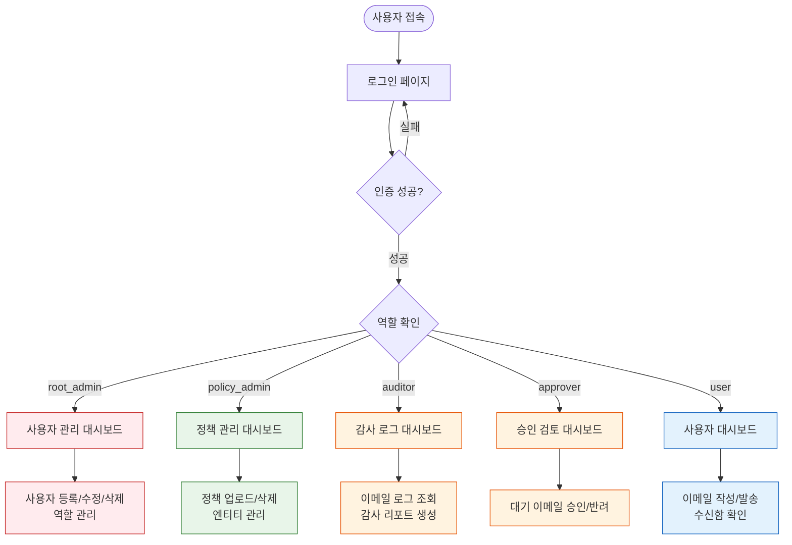
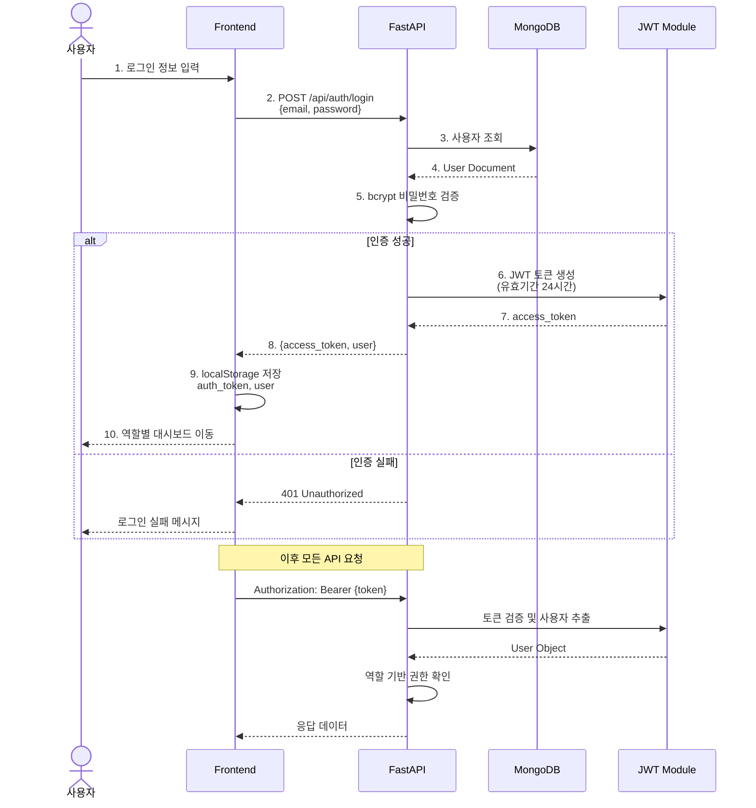
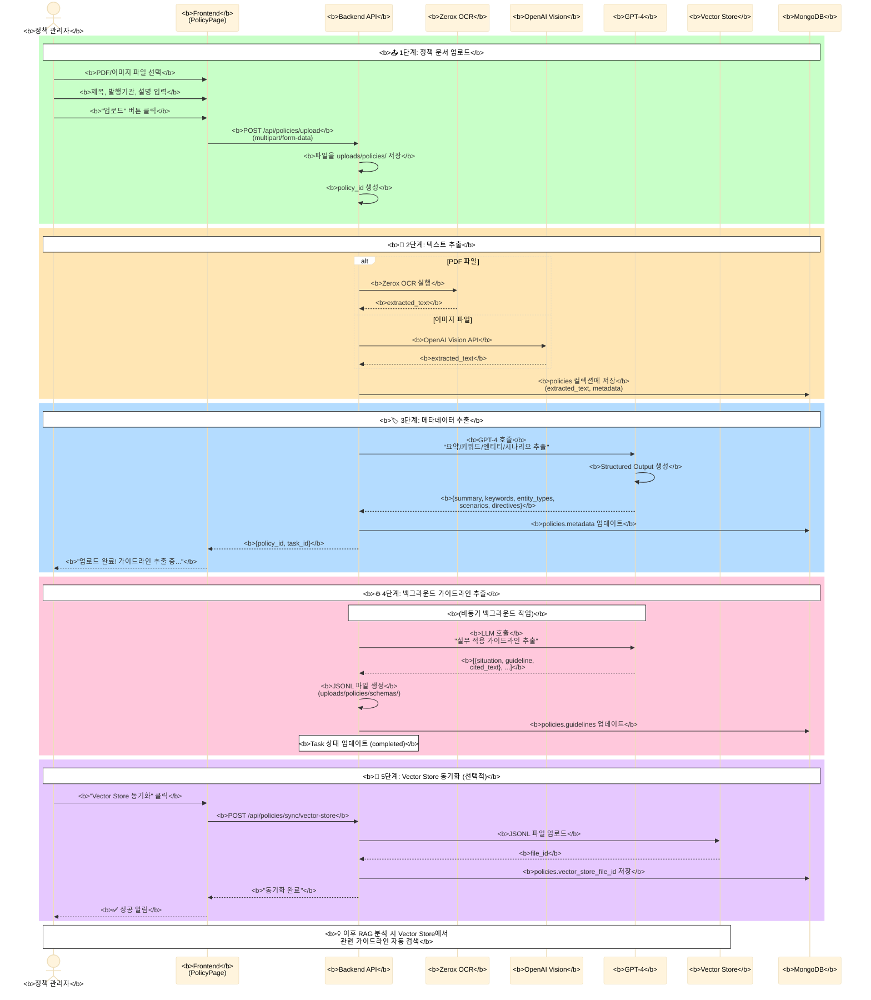
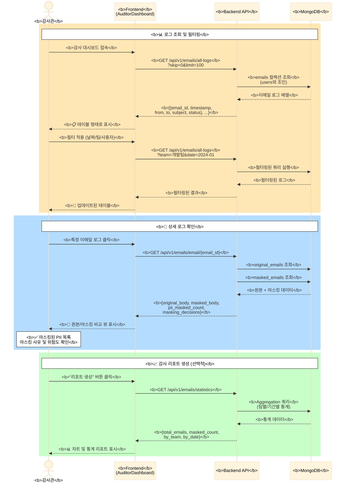

# 🏗️ 개인정보 보호 에이전트 시스템 아키텍처

이 문서는 Frontend(React), Backend(FastAPI), 그리고 RAG 기반 AI 엔진의 전체 아키텍처 및 데이터 흐름을 기술합니다.

## 📊 시스템 구조도 (Mermaid)



---

## 👥 사용자 플로우 (User Flows)

### 역할별 시스템 접근 흐름



### 🔐 인증/인가 플로우



### 📧 이메일 작성 → AI 분석 → 마스킹 → 전송 플로우

```mermaid
%%{init: {'theme':'base', 'themeVariables': { 'fontSize':'16px', 'fontFamily':'arial', 'actorTextColor':'#000', 'noteBkgColor':'#fff', 'noteBorderColor':'#000', 'noteTextColor':'#000'}}}%%
sequenceDiagram
    actor User as <b>사용자</b>
    participant FE as <b>Frontend</b><br/>(WriteEmailPage)
    participant Mask as <b>MaskingPage</b>
    participant API as <b>Backend API</b>
    participant OCR as <b>OCR Engine</b>
    participant Analyzer as <b>PII Analyzer</b>
    participant RAG as <b>RAG Engine</b><br/>(LangGraph)
    participant SMTP as <b>SMTP Server</b>
    participant DB as <b>MongoDB</b>

    rect rgb(173, 216, 230)
        Note over User,DB: <b>📝 1단계: 이메일 작성</b>
        User->>+FE: <b>수신자/제목/본문/첨부파일 입력</b>
        User->>FE: <b>"마스킹 진행" 버튼 클릭</b>
        FE->>+API: <b>POST /api/v1/files/upload_email</b>
        API->>+DB: <b>original_emails 저장</b>
        DB-->>-API: <b>email_id</b>
        API-->>-FE: <b>{email_id}</b>
        FE->>-Mask: <b>MaskingPage로 이동</b>
    end

    rect rgb(144, 238, 144)
        Note over User,DB: <b>⚙️ 2단계: 컨텍스트 설정</b>
        User->>+Mask: <b>발신/수신 유형 선택</b><br/>(내부↔내부, 내부→외부 등)
        User->>Mask: <b>목적 및 규정 선택</b><br/>(GDPR, 개인정보보호법 등)
        User->>-Mask: <b>"AI 분석 시작" 클릭</b>
    end

    rect rgb(255, 218, 185)
        Note over User,DB: <b>🔍 3단계: PII 탐지 (5-Stage Pipeline)</b>

        Note over Mask,Analyzer: <b>📌 Stage 1: 본문 PII 추출</b>
        Mask->>+Analyzer: <b>POST /api/v1/analyzer/analyze/text</b><br/>{text: email.body}
        Analyzer->>Analyzer: <b>Regex + NER 분석</b><br/>(이름/전화/이메일/주민번호 등)
        Analyzer-->>-Mask: <b>{entities: [...]}</b>

        Note over Mask,OCR: <b>📌 Stage 2: 첨부파일 PII 추출</b>
        loop 각 첨부파일
            Mask->>+OCR: <b>POST /api/v1/ocr/extract/ocr</b>
            OCR->>OCR: <b>PDF/이미지 텍스트 추출</b><br/>(Zerox/Vision API)
            OCR-->>-Mask: <b>{text, coordinates}</b>
            Mask->>+Analyzer: <b>POST /api/v1/analyzer/analyze/text</b>
            Analyzer-->>-Mask: <b>{entities: [...]}</b>
        end

        Note over Mask: <b>📌 Stage 3: 프론트엔드 Regex 검증</b>
        Mask->>Mask: <b>추가 정규식 패턴 검사</b><br/>(이메일, 전화번호, 계좌번호 등)

        Note over Mask: <b>📌 Stage 4: 중복 제거 및 통합</b>
        Mask->>Mask: <b>백엔드 + Regex 결과 병합</b><br/>중복 PII 제거

        Note over Mask,RAG: <b>📌 Stage 5: RAG 기반 마스킹 권고</b>
        Mask->>+RAG: <b>POST /api/vectordb/analyze-stream</b><br/>{context, pii_list, regulations}
        RAG->>RAG: <b>Vector DB에서 관련 정책 검색</b>
        RAG->>RAG: <b>GPT-4 추론</b><br/>(각 PII별 마스킹 여부 판단)
        RAG-->>-Mask: <b>Stream {pii_0: {should_mask, reason, risk_level}}</b>
        Mask-->>User: <b>PII 체크박스 목록 + AI 권고 표시</b>
    end

    rect rgb(255, 182, 193)
        Note over User,DB: <b>🎭 4단계: 마스킹 실행</b>
        User->>+Mask: <b>PII 선택 토글 (체크박스)</b>
        User->>Mask: <b>"선택된 PII 마스킹" 클릭</b>

        Mask->>Mask: <b>본문 텍스트 마스킹</b><br/>(선택된 PII → ***)

        loop 첨부파일 마스킹
            Mask->>+API: <b>POST /api/v1/process/masking/pdf</b><br/>{file, coordinates, pii_to_mask}
            API->>API: <b>이미지/PDF에 검은색 박스 덮기</b>
            API-->>-Mask: <b>masked_file (Base64)</b>
        end

        Mask->>+API: <b>POST /api/v1/process/masking/save-masked-email</b>
        API->>+DB: <b>masked_emails 저장</b>
        DB-->>-API: <b>masked_email_id</b>
        API-->>-Mask: <b>{masked_email_id}</b>

        Mask-->>-User: <b>마스킹된 이메일 미리보기</b>
    end

    rect rgb(221, 160, 221)
        Note over User,DB: <b>📤 5단계: 이메일 전송</b>
        User->>+Mask: <b>"마스킹된 이메일 전송" 클릭</b>
        Mask->>+SMTP: <b>POST /smtp/send</b><br/>{to, subject, masked_body, attachments}
        SMTP->>SMTP: <b>SMTP 서버로 실제 전송</b>
        SMTP->>+DB: <b>emails 컬렉션에 기록</b><br/>(sent, from, to, masked_body 등)
        SMTP->>DB: <b>audit_logs에 감사 로그 기록</b>
        DB-->>-SMTP: ✓
        SMTP-->>-Mask: <b>{status: "sent"}</b>
        Mask-->>-User: <b>✅ "전송 완료!" 알림</b>
        User->>FE: <b>대시보드로 복귀</b>
    end
```

### 📋 정책 업로드 및 RAG 인덱싱 플로우



### 🔍 감사관 - 이메일 로그 조회 플로우



---

## 📊 주요 데이터베이스 컬렉션 및 스키마

### MongoDB Collections

#### 1. `users` - 사용자 관리

```json
{
  "_id": ObjectId,
  "email": "user@example.com",
  "hashed_password": "$2b$12$...",
  "nickname": "홍길동",
  "team_name": "개발팀",
  "department": "IT",
  "role": "user | policy_admin | auditor | approver | root_admin",
  "phone_number": "010-1234-5678",
  "smtp_config": {
    "smtp_host": "smtp.gmail.com",
    "smtp_port": 587,
    "smtp_user": "user@gmail.com",
    "smtp_password": "encrypted_password",
    "smtp_use_tls": true
  },
  "created_at": ISODate("2024-01-01T00:00:00Z"),
  "updated_at": ISODate("2024-01-01T00:00:00Z")
}
```

#### 2. `policies` - 정책 문서

```json
{
  "_id": ObjectId,
  "policy_id": "policy_20240101_120000_abc123",
  "title": "개인정보 보호법 시행령",
  "authority": "개인정보보호위원회",
  "description": "개인정보 처리 및 보호에 관한 법률",
  "original_filename": "privacy_law.pdf",
  "saved_filename": "policy_20240101_120000_abc123.pdf",
  "file_type": ".pdf",
  "file_size_mb": 2.5,
  "processing_method": "zerox_ocr | pymupdf | vision_api",
  "extracted_text": "전체 텍스트 내용...",
  "metadata": {
    "summary": "개인정보 보호 규정 요약",
    "keywords": ["개인정보", "암호화", "동의"],
    "entity_types": ["주민등록번호", "신용카드번호"],
    "scenarios": ["고객 정보 수집", "마케팅 활용"],
    "directives": ["필수 동의 필요", "암호화 저장"]
  },
  "guidelines": [
    {
      "situation": "고객에게 이메일 발송 시",
      "guideline": "주민등록번호는 반드시 마스킹",
      "cited_text": "제24조 제1항...",
      "risk_level": "high"
    }
  ],
  "vector_store_file_id": "file-abc123",
  "vector_store_synced_at": ISODate("2024-01-01T00:00:00Z"),
  "created_by": "admin@example.com",
  "created_at": ISODate("2024-01-01T00:00:00Z")
}
```

#### 3. `entities` - PII 엔티티 정의

```json
{
  "_id": ObjectId,
  "entity_id": "entity_email_address",
  "name": "이메일 주소",
  "category": "연락처",
  "description": "이메일 형식의 개인 연락처",
  "regex_pattern": "[a-zA-Z0-9._%+-]+@[a-zA-Z0-9.-]+\\.[a-zA-Z]{2,}",
  "keywords": ["email", "이메일", "@"],
  "examples": ["user@example.com", "test@test.co.kr"],
  "masking_type": "partial",
  "masking_char": "*",
  "sensitivity_level": "medium",
  "is_active": true,
  "created_at": ISODate("2024-01-01T00:00:00Z")
}
```

#### 4. `original_emails` - 원본 이메일

```json
{
  "_id": ObjectId,
  "email_id": "email_20240101_120000_xyz789",
  "from_email": "sender@example.com",
  "to_emails": ["receiver@example.com"],
  "subject": "프로젝트 관련 문의",
  "original_body": "안녕하세요. 홍길동(010-1234-5678)입니다...",
  "attachments": [
    {
      "filename": "document.pdf",
      "content_type": "application/pdf",
      "size": 102400,
      "data": "base64_encoded_data..."
    }
  ],
  "created_at": ISODate("2024-01-01T12:00:00Z")
}
```

#### 5. `masked_emails` - 마스킹된 이메일

```json
{
  "_id": ObjectId,
  "email_id": "email_20240101_120000_xyz789",
  "masked_body": "안녕하세요. ***(***-****-****)입니다...",
  "masked_attachments": [
    {
      "filename": "document_masked.pdf",
      "content_type": "application/pdf",
      "size": 105000,
      "data": "base64_encoded_masked_data..."
    }
  ],
  "masking_decisions": {
    "pii_0": {
      "type": "이름",
      "value": "홍길동",
      "should_mask": true,
      "masked_value": "***",
      "reason": "외부 발송 시 이름 마스킹 권장",
      "risk_level": "medium",
      "cited_guidelines": ["개인정보 보호법 제24조"]
    },
    "pii_1": {
      "type": "전화번호",
      "value": "010-1234-5678",
      "should_mask": true,
      "masked_value": "***-****-****",
      "reason": "민감한 연락처 정보",
      "risk_level": "high",
      "cited_guidelines": ["GDPR Article 6"]
    }
  },
  "pii_masked_count": 2,
  "created_at": ISODate("2024-01-01T12:05:00Z")
}
```

#### 6. `emails` - 전송 기록

```json
{
  "_id": ObjectId,
  "from_email": "sender@example.com",
  "to_email": "receiver@external.com",
  "cc": "",
  "bcc": "",
  "subject": "프로젝트 관련 문의",
  "original_body": "안녕하세요. 홍길동(010-1234-5678)입니다...",
  "masked_body": "안녕하세요. ***(***-****-****)입니다...",
  "status": "sent | pending | failed",
  "attachments": [
    {
      "filename": "document_masked.pdf",
      "size": 105000,
      "content_type": "application/pdf"
    }
  ],
  "team_name": "개발팀",
  "owner_email": "sender@example.com",
  "masked_email_id": "email_20240101_120000_xyz789",
  "sent_at": ISODate("2024-01-01T12:10:00Z"),
  "read_at": null,
  "created_at": ISODate("2024-01-01T12:10:00Z")
}
```

#### 7. `audit_logs` - 감사 로그

```json
{
  "_id": ObjectId,
  "event_type": "EMAIL_SEND | POLICY_UPLOAD | LOGIN | etc",
  "user_email": "user@example.com",
  "user_role": "user",
  "action": "이메일 전송",
  "resource_type": "email",
  "resource_id": "email_20240101_120000_xyz789",
  "success": true,
  "error_message": null,
  "severity": "INFO | WARNING | ERROR",
  "ip_address": "192.168.1.100",
  "user_agent": "Mozilla/5.0...",
  "created_at": ISODate("2024-01-01T12:10:00Z")
}
```

---

## 🔑 핵심 API 엔드포인트 정리

### 인증 관련
- `POST /api/auth/register` - 사용자 등록
- `POST /api/auth/login` - 로그인 (JWT 토큰 발급)
- `GET /api/auth/me` - 현재 사용자 정보 조회

### 정책 관리
- `POST /api/policies/upload` - 정책 문서 업로드
- `GET /api/policies/list` - 정책 목록 조회
- `GET /api/policies/{policy_id}` - 정책 상세 조회
- `DELETE /api/policies/{policy_id}` - 정책 삭제
- `POST /api/policies/sync/vector-store` - Vector Store 동기화

### 엔티티 관리
- `POST /api/entities/` - 커스텀 PII 엔티티 생성
- `GET /api/entities/list` - 엔티티 목록 조회
- `DELETE /api/entities/{entity_id}` - 엔티티 삭제

### PII 탐지 및 분석
- `POST /api/v1/analyzer/analyze/text` - 텍스트에서 PII 탐지
- `POST /api/v1/ocr/extract/ocr` - 이미지/PDF OCR 처리
- `POST /api/vectordb/analyze-stream` - RAG 기반 AI 분석 (스트리밍)

### 마스킹 처리
- `POST /api/v1/process/masking/pdf` - PDF/이미지 마스킹
- `POST /api/v1/process/masking/save-masked-email` - 마스킹된 이메일 저장

### 이메일 관리
- `POST /api/v1/files/upload_email` - 이메일 업로드
- `GET /api/v1/emails/my-emails` - 발신 이메일 조회
- `GET /api/v1/emails/received-emails` - 수신 이메일 조회
- `GET /api/v1/emails/email/{email_id}` - 이메일 상세 조회
- `GET /api/v1/emails/all-logs` - 전체 이메일 로그 (감사관 전용)

### SMTP 전송
- `POST /smtp/send` - SMTP를 통한 이메일 전송
- `GET /smtp/emails` - 전송된 이메일 목록
- `GET /smtp/emails/{email_id}` - 전송 이메일 상세 조회

---

## 🎯 사용자 역할별 주요 기능 매트릭스

| 기능 | user | approver | auditor | policy_admin | root_admin |
|------|------|----------|---------|--------------|------------|
| 이메일 작성/발송 | ✅ | ✅ | ✅ | ✅ | ✅ |
| 수신 이메일 조회 | ✅ (본인) | ✅ (본인) | ✅ (전체) | ✅ (본인) | ✅ (전체) |
| PII 마스킹 실행 | ✅ | ✅ | ❌ | ✅ | ✅ |
| 정책 업로드/삭제 | ❌ | ❌ | ❌ | ✅ | ✅ |
| 엔티티 관리 | ❌ | ❌ | ❌ | ✅ | ✅ |
| 이메일 승인/반려 | ❌ | ✅ | ❌ | ❌ | ✅ |
| 감사 로그 조회 | ❌ | ❌ | ✅ | ❌ | ✅ |
| 사용자 관리 | ❌ | ❌ | ❌ | ❌ | ✅ |
| 시스템 설정 | ❌ | ❌ | ❌ | ❌ | ✅ |

---

## 📝 요약

MASKIT DLP 시스템의 핵심 사용자 플로우는 다음과 같습니다:

1. **인증/인가**: JWT 기반 토큰 인증 + 5단계 역할 기반 접근 제어
2. **정책 관리**: PDF/이미지 업로드 → OCR → LLM 메타데이터 추출 → Vector Store 인덱싱
3. **이메일 DLP**: 작성 → AI 분석 (5-Stage PII 탐지) → RAG 마스킹 권고 → 사용자 선택 → 마스킹 실행 → SMTP 전송
4. **감사/모니터링**: 실시간 로그 조회, 필터링, 통계 리포트 생성

모든 플로우는 MongoDB에 기록되며, 역할별 권한으로 접근이 제어됩니다.